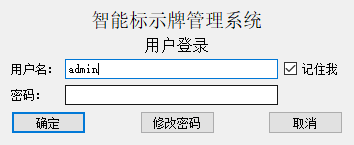
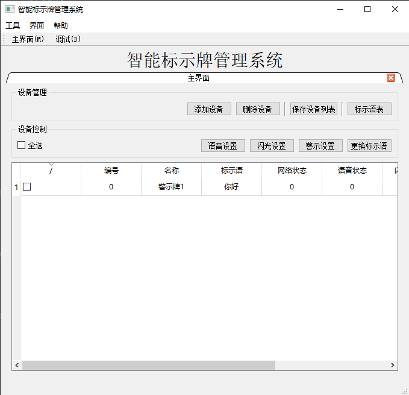

# 智能标示牌管理系统

基本框架为 协议解析状态机 + TCP，用到了单例模式、QT的多窗口以及Model/View模型，其中软件开屏展示登录窗口，验证通过后进入主窗口，在主窗口中利用MDI控件显示主界面以及调试窗口，其他未显示的窗口均有这几个窗口中的一些按键激活。

由于目前协议需要接收应答信号，并做出相应的动作，所以在每次发送数据时，均会绑定一个匿名函数作为回调函数处理对应的应答信号，这一块可能较为抽象，特此说明。

目前一共有如下9个窗口：

* `mainwindow`：主窗口，除了登录窗口外，其他的窗口都在该窗口下
* `qdialogadddev`：添加设备窗口
* `qdlgabout`：关于窗口，显示软件的一些信息
* `qdlglogin`：登录窗口
* `qformdebug`：调试窗口
* `qformdebugcmd`：调试命令窗口
* `qformmain`：主界面，用户的一般操作都在该界面下
* `qformoptions`：软件设置窗口
* `qformsigntable`：标示语窗口

一些基本的界面展示：

